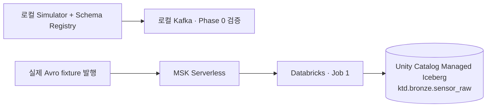

# Kitchen to Digital (KTD)

주방 장비의 센서 이벤트를 원본부터 장비 상태와 집계까지 추적하는 데이터 엔지니어링 프로젝트다.
같은 측정이 다시 발행되거나 payload가 손상됐을 때 무엇이 들어왔는지 남기고,
처리가 중단된 뒤에는 Kafka 기록과 저장 결과를 대조할 수 있게 만드는 데서 시작했다.
Digital Twin의 현재 상태와 과거 이력을 연결하는 것이 후속 목표다.

## 현재 데이터 흐름

Phase 0에서 로컬 Kafka·Schema Registry·Avro Simulator를 검증했고,
Phase 1에서는 **MSK Serverless → Databricks Structured Streaming → Managed Iceberg Bronze**까지 구현·검증했다.



로컬 Kafka를 Databricks에서 직접 읽으려 했지만 advertised listener가 `localhost:9092`를
가리켜 원격 compute에서 접근할 수 없었다. Phase 1 cloud 검증은 MSK Serverless로 전환했다.
로컬 Registry 검증과 cloud fixture 적재는 별도 경로이며, cloud Schema Registry 운영 방식과
장기 Producer 환경은 아직 확정하지 않았다.

## 구현한 범위

- **Phase 0:** local Kafka + Schema Registry + Avro Simulator. Avro roundtrip,
  schema compatibility, SIGINT와 Kafka/Registry 중단·재시작을 검증했다.
- **Phase 1:** MSK IAM 연결, Databricks batch read, Job 1의 Bronze 적재.
  raw key/value bytes, headers, Kafka timestamp와 topic/partition/offset을 보존한다.
- **Phase 2 이후:** 품질 검증·Silver, Gold 집계, DynamoDB 현재 상태와 경보는 계획이며 미구현이다.

## 중요한 설계 선택

Bronze에서는 Avro decode나 event_id dedup을 하지 않는다. 동일 event_id가 다른 offset으로
재발행되면 두 원본을 모두 남긴다. 해석할 수 없는 payload도 저장해 이후 검증·재처리의
입력으로 쓸 수 있도록 했다. 실제 재처리 Job은 후속 구현 범위다.

Phase 1 저장 경로는 Unity Catalog Managed Iceberg다. GlueCatalog 직접 연결과 외부 Iceberg
JAR·extension을 사용하지 않는다. 초기 Bronze는 Managed Iceberg 제약 때문에
`days(ingested_at)`을 적용하지 않은 unpartitioned table로 검증했다.
Job 1 checkpoint는 전용 UC Volume 경로에 두고 정상 재시작 때 그대로 사용한다.

## 검증한 장애와 복구

MSK fixture의 partition 1 offset 0/1에는 동일 event_id의 두 원본이 각각 남았고,
offset 2의 corrupt payload도 Job을 중단시키지 않고 raw bytes `0000`으로 보존됐다.
기존 checkpoint로 정상 재시작했을 때 기존 offset 중복은 없었다.

별도 table/checkpoint에서는 sink 저장 후 최신 `commits/N`만 백업·격리해 checkpoint commit이
끝나지 않은 상태를 재현했다. 실제 프로세스를 kill한 실험은 아니다. 동일 checkpoint로
재시작해 같은 batch와 offset 경계, commit 재생성, 원본 보존을 확인했다.
**이번 fixture와 failure-state 조건에서 `(topic, partition, offset)` 기준 중복·누락이 없었다.**
이는 전체 시스템의 exactly-once 보장이나 Managed Iceberg 내부 replay 방식의 증명은 아니다.

최종 clean run은 `1 passed in 43.36s`로 끝났다. `numInputRows=0` 관찰 후 검증 기준을
수정한 과정과 실행 식별자는 [Phase 1 검증 기록](docs/reports/phase-1-verification.md)에 있다.

## 실행과 문서

Kafka/Registry가 실행 중이고 기본 스키마가 등록된 로컬 환경에서 저장소 루트 기준으로 실행한다.

```bash
uv sync --locked
uv run python -m simulator.main --count 1
```

수치형 장비마다 1건씩 현재 총 4건을 raw에 추가한다. 빈 환경 전체 구축과 스키마 등록 자동화는 아직 검증되지 않았다.

- [로컬 환경과 실행](docs/local-development.md) · [Phase 0 검증 기록](docs/reports/phase-0-verification.md)
- [Databricks·AWS 구성](docs/databricks-aws-setup.md) · [Job 실행과 복구 runbook](docs/runbook.md)
- [Phase 1 검증 기록](docs/reports/phase-1-verification.md)
- [데이터 계약](docs/data/data-contract.md) · [현재 플랫폼과 후속 Job 설계](docs/architecture/platform.md)
- [전체 목표 도식](docs/architecture/diagrams.md) · [문서 목록](docs/README.md)
