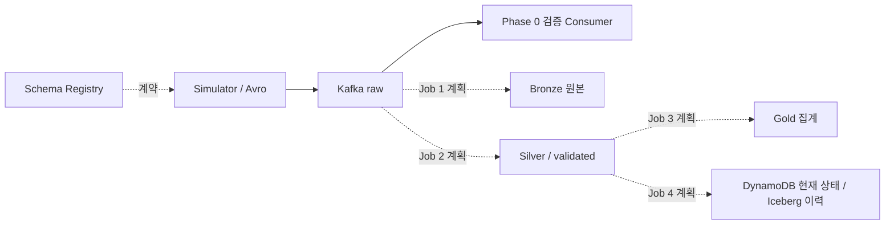

# Kitchen to Digital (KTD)

주방 장비의 센서 이벤트를 수집·검증·집계해 Digital Twin으로 연결하는 데이터 엔지니어링 프로젝트다.
원본 보존, 데이터 품질, 최신 장비 상태와 과거 이력의 분리를 통해 지연·중복·장애 상황에서도 결과를 설명하고 복구할 수 있는 구조를 목표로 한다.

현재 구현 범위는 **Phase 0: 로컬 Kafka + Schema Registry + Avro Simulator**다.
Avro 왕복·호환성·로컬 재시작의 기존 실행 결과는 [Phase 0 검증 기록](docs/reports/phase-0-verification.md)에 있다.
Databricks와 클라우드 저장 경로는 후속 설계다.

## 데이터 흐름과 설계 특징



- Kafka key는 `equipment_id`, 측정 이벤트 식별자는 `event_id`로 분리한다.
- Avro와 Registry로 구조적 계약을 관리하고, 업무 품질 검증은 후속 Job 2가 담당한다.
- 목표 플랫폼은 Databricks PySpark + S3/Iceberg + Glue Catalog다. Bronze 원본을 기반으로 재처리하고, query별 checkpoint와 sink 멱등성으로 복구 경계를 나눈다.
- 현재 상태는 DynamoDB, 이력은 Iceberg에 분리하는 설계다. 독립 Job과 복수 sink는 장애 격리에 유리하지만 이중 쓰기 복구가 필요하다.

## 로컬 실행

Kafka/Registry가 실행 중이고 기본 스키마가 등록된 기존 환경에서 저장소 루트 기준으로 실행한다.

```bash
uv sync --locked
uv run python -m simulator.main --count 1
```

수치형 장비마다 1건씩 현재 총 4건을 raw에 추가한다. 빈 환경 전체 구축과 스키마 등록 자동화는 아직 검증되지 않았다.

## 주요 문서

- [로컬 환경과 실행](docs/local-development.md)
- [데이터 계약](docs/data/data-contract.md)
- [전체 구조와 흐름도](docs/architecture/diagrams.md)
- [분야별 설계](docs/architecture/design-decisions.md)
- [호환성·장애 검증](docs/schema-evolution-test.md)
- [문서 목록](docs/README.md)
