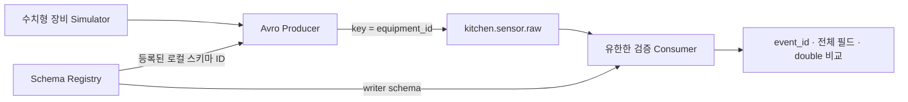

# Kitchen to Digital (KTD)

주방 장비의 센서 이벤트를 수집하고 검증·집계해 Digital Twin으로 연결하는 데이터 엔지니어링 프로젝트다.

현재 구현·검증 범위는 **Phase 0: 로컬 Kafka + Schema Registry + Avro Simulator**다.
Databricks/S3/Iceberg/Glue/DynamoDB는 후속 설계이며 클라우드 적재 완료를 의미하지 않는다.



- [로컬 실행과 테스트](docs/local-development.md): 준비 조건, 환경 변수, 유한 실행, 장애 검사 주의사항.
- [실제 데이터 계약](docs/data/data-contract.md): 10개 필드와 Kafka key 계약.
- [호환성·장애 검사 해설](docs/schema-evolution-test.md): BACKWARD, 잘못된 입력, 종료와 복구.
- [Phase 0 검증 기록](docs/reports/phase-0-verification.md): 실행 결과, 증빙, 미검증 범위와 병합 조건.
- [전체 설계 문서](docs/README.md): 구현 결과와 구분해서 읽는 후속 아키텍처.

등록된 기본 스키마를 사용하며, nullable `firmware_version`을 추가한 Registry v2는
호환성 실험용이다. 현재 Producer 계약에 필드를 추가한 것이 아니다.

기존 로컬 환경의 빠른 확인 명령(저장소 루트):

```bash
uv sync --locked
docker compose -f infra/docker/compose.yml ps -a
uv run python -m pytest -q
KTD_RUN_INTEGRATION=1 uv run python -m pytest -q -s
```

통합 검사는 Kafka/Registry와 등록된 v1/v2가 필요하며 실제 raw에 레코드를 추가한다.
기본 pytest는 외부 서비스 검사를 건너뛴다. 서비스 중단 검사는 별도 opt-in이며
[실행 안내](docs/local-development.md)를 먼저 확인한다. 빈 환경 전체 구축은 아직 재검증하지 않았다.

증빙은 로컬 `screenshots/phase-0/`에 보관하며 Git 제외 설정을 유지한다.
Phase 1은 Phase 0 변경의 사용자 commit/push 및 PR 검토·main 병합 후 시작한다.
