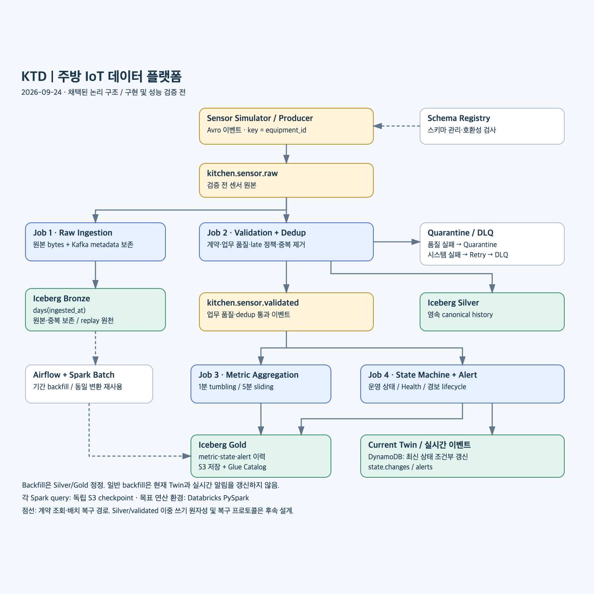
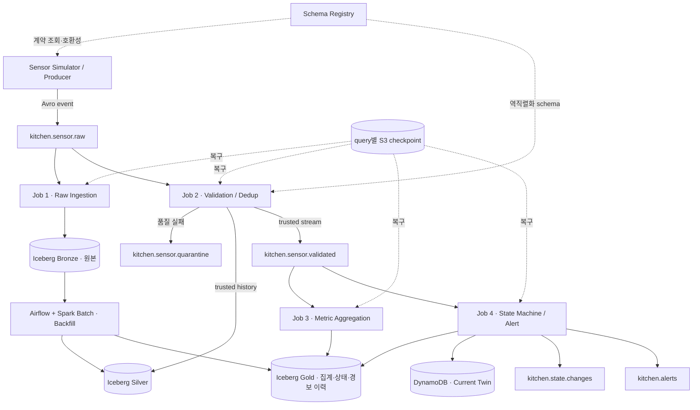
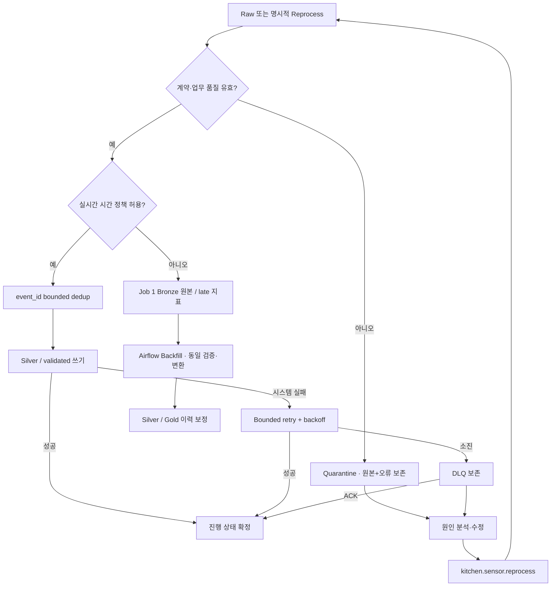
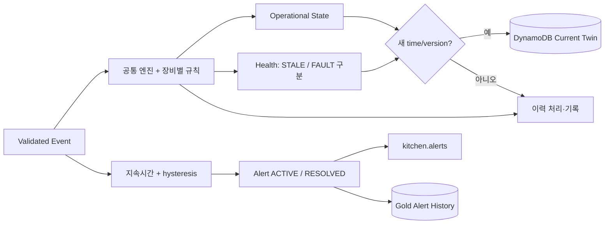
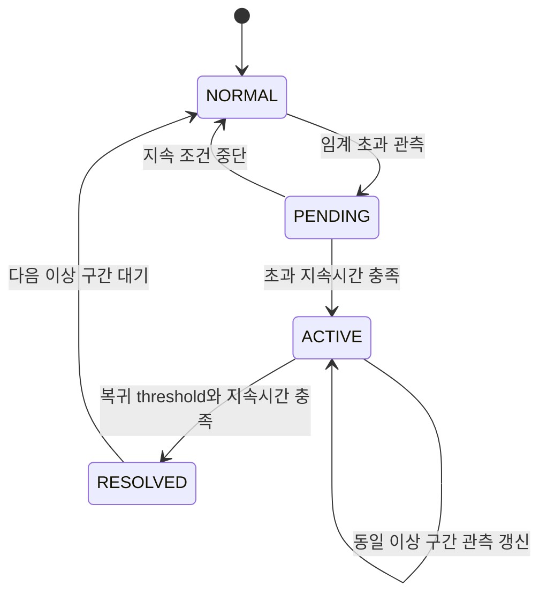
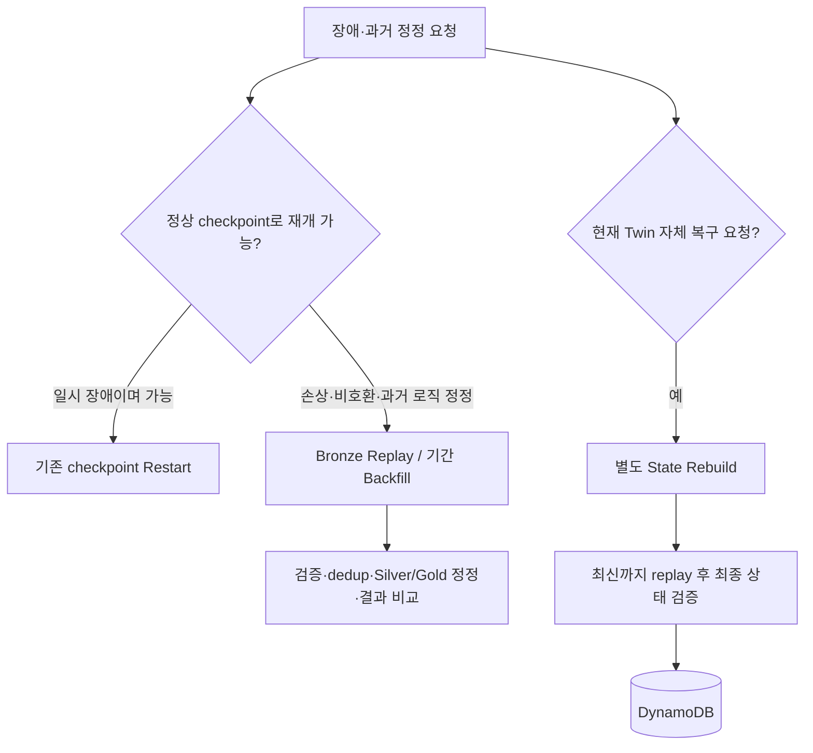

# KTD 최종 구조와 처리 흐름

2026-09-24 · 채택된 논리 구조를 표시한다. 구현 완료도나 분산 트랜잭션 보장도가 아니다.

Mermaid를 지원하지 않는 뷰어에서는 [전체 아키텍처 SVG](../diagrams/ktd-architecture.svg)를 연다. 아래 코드 블록은 편집 가능한 도식 원본이다.

[PNG 이미지](../diagrams/ktd-architecture.png)도 함께 제공한다.

## 1. 전체 아키텍처

Iceberg 데이터는 S3, catalog는 Glue, 목표 Spark 실행 환경은 Databricks다. Registry는 데이터가 통과하는 브로커가 아니라 계약 관리 서비스다. Silver와 validated는 Job 2의 두 출력이며 원자적 이중 쓰기 보장은 미정이다. 일반 backfill은 DynamoDB와 실시간 알림을 건드리지 않는다.

## 2. 검증·실패·재처리

보존 ACK가 실패하면 진행 상태를 성공으로 확정하지 않는다. 직접 consumer의 offset commit과 Spark checkpoint 완료는 서로 다른 구현이다. 개별 재처리가 너무 늦으면 실시간 경로를 강제하지 않고 backfill한다.

## 3. 현재 상태와 경보

ACTIVE는 앞선 OPEN과 의미를 통일한 문서 표기다. 외부 lifecycle enum, 결측 구간 처리와 timer 구현은 후속 명세에서 정한다.

## 4. 복구 선택

과거 backfill과 current-state rebuild는 별개 작업이다. 모든 그림의 구체 실행 순서·writer 원자성·late 정렬 방식은 구현 전에 검증한다.
