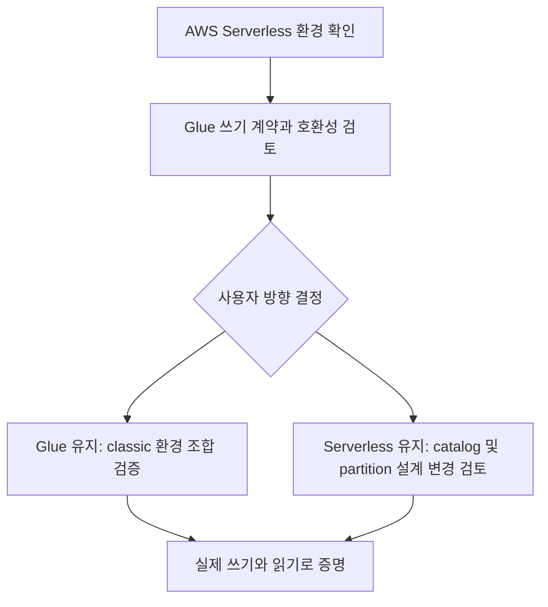

# Databricks / AWS 실행 환경 사전 검토

## 현재 환경 — Classic 전환

| 항목 | 설정 |
|---|---|
| Cloud / Region | AWS / ap-northeast-2 (Seoul) |
| Compute / access mode | Classic / Standard |
| Runtime | Databricks Runtime 17.3 LTS |
| Spark / Scala | 4.0.0 / 2.13 |
| 개발 노드 | Single Node, r5d.large, 사용자 보고 2 cores / 16 GB |
| Auto termination | 15분 |

[DBR 17.3 LTS 릴리스 문서](https://docs.databricks.com/aws/en/release-notes/runtime/17.3lts)의
Spark 4.0.0 / Scala 2.13 계열과 일치한다. 실제 실행 환경 출력은 아래 절차로 확인한다.
[Single Node 설명](https://docs.databricks.com/aws/en/compute/configure#single-node-compute)에
따르면 driver가 worker 역할도 수행한다. 이 구성의 성공은 다중 노드 성능 검증이 아니다.

## 의존성 판단과 남은 확인

1. Kafka/Avro는 DBR 제공 기능을 먼저 확인한다. 로컬 Python confluent-kafka를 설치하는
   것과 Spark의 JVM connector를 준비하는 것은 별개다. Spark 자체나 Kafka connector를
   임의로 중복 설치하지 않는다.
2. [Apache Iceberg 호환표](https://iceberg.apache.org/multi-engine-support/)에서
   Spark 4.0 / Scala 2.13용 artifact는 `iceberg-spark-runtime-4.0_2.13`이며
   Spark 4.0 지원은 Iceberg 1.10.0부터다. Spark 3.5 / Scala 2.12용 JAR을 쓰지 않는다.
   이는 upstream artifact 선택 근거이며 DBR에서의 동작 보장은 아니다.
3. Iceberg runtime과 AWS bundle의 실제 버전은 아직 고정/설치하지 않았다.
   기존 Libraries 목록과 Standard의 library 정책, Glue 인증 전달 방법을 확인한 뒤
   같은 Iceberg 릴리스 조합으로 catalog 로딩 및 쓰기를 검증한다.
4. [Standard 제한](https://docs.databricks.com/aws/en/compute/standard-limitations)에
   따른 인증/스토리지 접근 조건을 확인해야 한다. IMDS에 의존하는 AWS 자격증명 자동
   획득을 가정하지 않는다. 지원되는 service credential이 있어도 임의 Java GlueCatalog가
   자동으로 이를 사용한다고 가정하지 않는다.
5. Glue foreign catalog의 읽기 전용 제약은 Classic 전환만으로 사라지지 않는다.
   직접 Iceberg GlueCatalog를 사용하는 경로의 권한과 호환성은 별도 실증 대상이다.

## 다음 실행: 외부 쓰기 없는 Runtime / Avro 확인

Databricks Python notebook을 위 Classic compute에 연결하고 다음 셀을 실행한다.
Kafka 연결·Registry 조회·S3/Glue 변경은 하지 않는다. 컴퓨트 실행 비용은 발생할 수 있다.

```python
import json

from pyspark.sql.avro.functions import from_avro, to_avro
from pyspark.sql.functions import col

print(f"Spark version: {spark.version}")
assert spark.version.startswith("4.0."), spark.version

schema = json.dumps({"type": "double"})
source = spark.range(1).selectExpr("CAST(2.5 AS DOUBLE) AS metric_value")
encoded = source.select(to_avro(col("metric_value"), schema).alias("payload"))
decoded = encoded.select(
    from_avro(col("payload"), schema).alias("metric_value")
)
value = decoded.collect()[0]["metric_value"]
assert type(value) is float and value == 2.5
print("AVRO FUNCTION ROUNDTRIP OK: metric_value=2.5")
```

이 셀의 성공은 Spark 내장 Avro 함수만 검증한다. Confluent wire format/schema ID,
Registry, Kafka, Iceberg 검증과 구분한다.

실행 후 Spark version과 성공 문구, Compute 설정의 Runtime/access mode,
Libraries 목록을 확인한다. 비밀값을 제외한 실행 화면은
`screenshots/phase-1/runtime-avro-check.png`에 증빙으로 보관한다.
현재 Codex에는 해당 Workspace 화면/실행 연결이 없으므로 촬영 및 클라우드 실행은 미수행이다.
결과와 Libraries 목록을 받으면 의존성 설치가 필요한지 판단할 수 있다.

**현재 판정:** 실행 환경 선택은 완료(사용자 확인). Phase 1 첫 작업의
Kafka/Avro/Iceberg 실행 호환성 확정은 아직 미완료. 지역·설정은 더 이상 Serverless로 취급하지 않는다.

## 이전 Serverless 검토 이력 — 현재 설정에 적용하지 않음


### 현재 확인한 환경

| 항목 | 상태 / 근거 |
|---|---|
| Cloud / compute | 사용자 확인: AWS / Serverless |
| Region | 미확인. ap-northeast-2는 조건부 답변이므로 확정하지 않음 |
| Runtime / access mode | 사용자가 classic DBR 및 Standard/Dedicated를 선택하는 환경이 아님 |
| 실제 environment version / Spark version | 아직 수집하지 않음 |
| Unity Catalog 권한 / S3 / Glue / IAM | 아직 확인하지 않음 |
| Kafka / Registry | 저장소 Compose는 호스트 localhost용. Databricks 연결 미검증 |

### 공식 문서와 구현 영향

- [Serverless 제한](https://docs.databricks.com/aws/en/compute/serverless/limitations):
  Kafka/Avro/Iceberg 데이터 소스를 지원하지만 Maven coordinates, notebook JAR 및
  compute-scoped custom data sources/Spark extensions는 지원하지 않는다.
  로컬 confluent-kafka 버전은 Spark connector 호환성의 증거가 아니다.
- 같은 문서에서 notebook/job Structured Streaming은 AvailableNow/Once를 지원하며
  ProcessingTime/Continuous trigger는 지원하지 않는다. 첫 유한 검증은 AvailableNow가
  후보이며, 상시 실행 방식은 별도 결정한다. Continuous trigger와 연속 job schedule은 다르다.
- [Iceberg 테이블](https://docs.databricks.com/aws/en/iceberg/):
  Unity Catalog managed Iceberg와 외부 catalog의 foreign Iceberg를 구분한다.
  foreign Iceberg는 읽기 전용이다. managed Iceberg도 days() 등 표현식 partition을
  지원하지 않으므로 기존 days(ingested_at) 설계를 그대로 옮길 수 있다고 가정하지 않는다.
- [Glue federation](https://docs.databricks.com/aws/en/query-federation/hms-federation-concepts):
  Glue를 foreign catalog로 연결하는 경로는 읽기 전용이다.
  이는 직접 GlueCatalog를 사용하는 모든 다른 실행 환경까지 불가능하다는 뜻은 아니다.

**판정:** 현재 Serverless notebook/job 환경에서 기존 S3 + Iceberg + Glue 쓰기 계약을
충족하는 실행 조합은 미확정이다. 지원되는 파일 포맷과 catalog 쓰기 권한/연동은 별개다.
설정 확인만으로 Phase 1 첫 작업 전체가 완료됐다고 표시하지 않는다.

### 다음 선택 — 아직 채택하지 않음

| 방향 | 유지 / 변경 | 다음 검증 |
|---|---|---|
| Glue 계약 유지 | classic compute 사용 가능 여부부터 확인 | Spark/Scala와 Iceberg runtime/AWS bundle 조합, catalog 설정 및 IAM, 실제 쓰기·읽기 검증 |
| Serverless 유지 | Unity Catalog managed Iceberg로 catalog 계약 변경 필요 | 권한·저장 위치·partition 대안·streaming sink 검증 |

우선 기존 계약을 유지하려면 classic compute 생성 권한 여부를 확인한다.
classic으로 바꾸면 자동 해결된다고 단정하지 않으며, 비용이 발생하는 compute 생성은
이 문서 작업에서 수행하지 않는다. Serverless 유지안을 선택하려면 catalog/partition 변경을
사용자가 결정한 후 관련 설계를 갱신한다. 임의로 Delta나 Unity Catalog로 대체하지 않는다.

### 사용자가 확인할 정보

1. Workspace의 실제 AWS region과 사용 중인 Serverless environment version.
2. Classic compute 생성 권한 유무(생성은 아직 불필요).
3. Unity Catalog 사용 여부와 쓸 수 있는 catalog/schema. 토큰·비밀값은 공유하지 않는다.

실행 환경 결정 후 최소 쓰기/읽기 실험으로 사용 조합을 확정한다. 이후 별도 작업에서
Kafka advertised listener와 Registry 접근을 확인한다. Databricks에서 localhost는
사용자의 Mac이 아니므로 Compose 주소를 그대로 쓰지 않는다.



### 검증과 증빙 상태

이번에는 공식 문서와 저장소 설정을 대조했다. Databricks 접속, connector 로딩,
Kafka 수신, S3/Iceberg 쓰기, Glue 조회는 실행하지 않았다. 성공 스크린샷은 아직 없다.
실제 실행 단계의 증빙은 사용자 요청대로 Git 제외된 screenshots/phase-1/에 저장한다.
