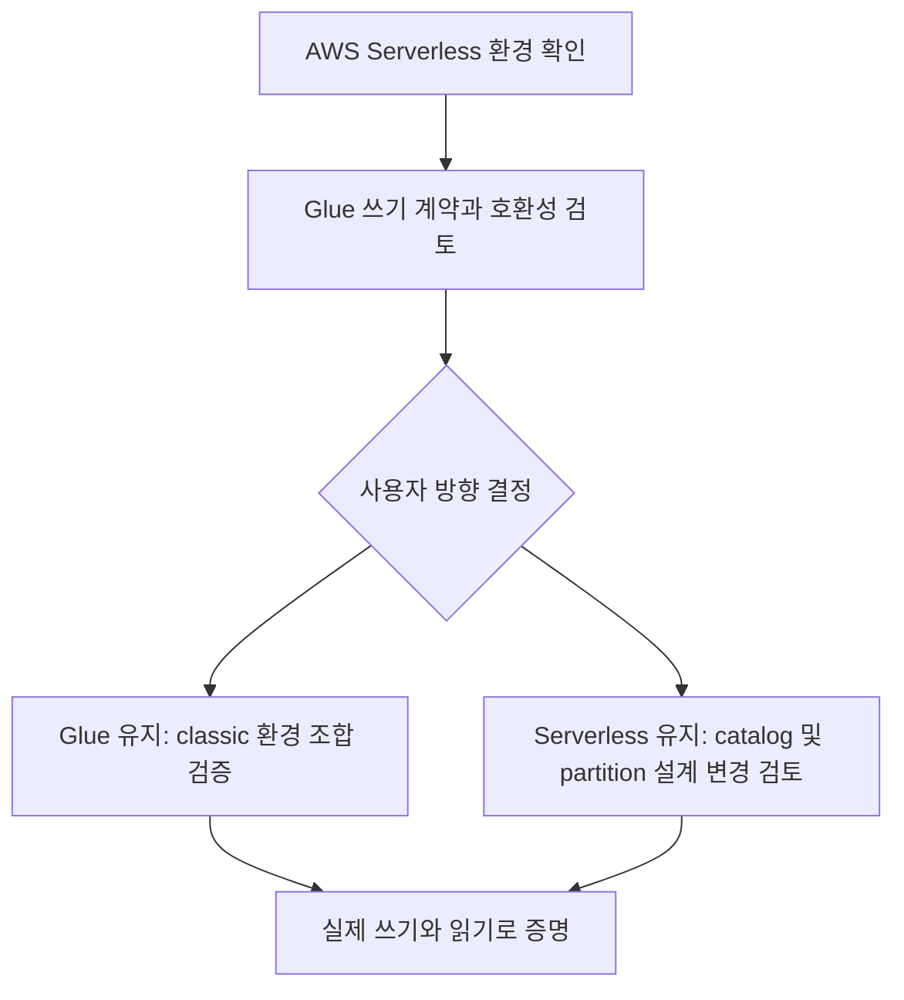

# Databricks / AWS 실행 환경 사전 검토

## 현재 확인한 환경

| 항목 | 상태 / 근거 |
|---|---|
| Cloud / compute | 사용자 확인: AWS / Serverless |
| Region | 미확인. ap-northeast-2는 조건부 답변이므로 확정하지 않음 |
| Runtime / access mode | 사용자가 classic DBR 및 Standard/Dedicated를 선택하는 환경이 아님 |
| 실제 environment version / Spark version | 아직 수집하지 않음 |
| Unity Catalog 권한 / S3 / Glue / IAM | 아직 확인하지 않음 |
| Kafka / Registry | 저장소 Compose는 호스트 localhost용. Databricks 연결 미검증 |

## 공식 문서와 구현 영향

- [Serverless 제한](https://docs.databricks.com/aws/en/compute/serverless/limitations):
  Kafka/Avro/Iceberg 데이터 소스를 지원하지만 Maven coordinates, notebook JAR 및
  compute-scoped custom data sources/Spark extensions는 지원하지 않는다.
  로컬 confluent-kafka 버전은 Spark connector 호환성의 증거가 아니다.
- 같은 문서에서 notebook/job Structured Streaming은 AvailableNow/Once를 지원하며
  ProcessingTime/Continuous trigger는 지원하지 않는다. 첫 유한 검증은 AvailableNow가
  후보이며, 상시 실행 방식은 별도 결정한다. Continuous trigger와 연속 job schedule은 다르다.
- [Iceberg 테이블](https://docs.databricks.com/aws/en/iceberg/):
  Unity Catalog managed Iceberg와 외부 catalog의 foreign Iceberg를 구분한다.
  foreign Iceberg는 읽기 전용이다. managed Iceberg도 days() 등 표현식 partition을
  지원하지 않으므로 기존 days(ingested_at) 설계를 그대로 옮길 수 있다고 가정하지 않는다.
- [Glue federation](https://docs.databricks.com/aws/en/query-federation/hms-federation-concepts):
  Glue를 foreign catalog로 연결하는 경로는 읽기 전용이다.
  이는 직접 GlueCatalog를 사용하는 모든 다른 실행 환경까지 불가능하다는 뜻은 아니다.

**판정:** 현재 Serverless notebook/job 환경에서 기존 S3 + Iceberg + Glue 쓰기 계약을
충족하는 실행 조합은 미확정이다. 지원되는 파일 포맷과 catalog 쓰기 권한/연동은 별개다.
설정 확인만으로 Phase 1 첫 작업 전체가 완료됐다고 표시하지 않는다.

## 다음 선택 — 아직 채택하지 않음

| 방향 | 유지 / 변경 | 다음 검증 |
|---|---|---|
| Glue 계약 유지 | classic compute 사용 가능 여부부터 확인 | Spark/Scala와 Iceberg runtime/AWS bundle 조합, catalog 설정 및 IAM, 실제 쓰기·읽기 검증 |
| Serverless 유지 | Unity Catalog managed Iceberg로 catalog 계약 변경 필요 | 권한·저장 위치·partition 대안·streaming sink 검증 |

우선 기존 계약을 유지하려면 classic compute 생성 권한 여부를 확인한다.
classic으로 바꾸면 자동 해결된다고 단정하지 않으며, 비용이 발생하는 compute 생성은
이 문서 작업에서 수행하지 않는다. Serverless 유지안을 선택하려면 catalog/partition 변경을
사용자가 결정한 후 관련 설계를 갱신한다. 임의로 Delta나 Unity Catalog로 대체하지 않는다.

## 사용자가 확인할 정보

1. Workspace의 실제 AWS region과 사용 중인 Serverless environment version.
2. Classic compute 생성 권한 유무(생성은 아직 불필요).
3. Unity Catalog 사용 여부와 쓸 수 있는 catalog/schema. 토큰·비밀값은 공유하지 않는다.

실행 환경 결정 후 최소 쓰기/읽기 실험으로 사용 조합을 확정한다. 이후 별도 작업에서
Kafka advertised listener와 Registry 접근을 확인한다. Databricks에서 localhost는
사용자의 Mac이 아니므로 Compose 주소를 그대로 쓰지 않는다.

## 검증과 증빙 상태

이번에는 공식 문서와 저장소 설정을 대조했다. Databricks 접속, connector 로딩,
Kafka 수신, S3/Iceberg 쓰기, Glue 조회는 실행하지 않았다. 성공 스크린샷은 아직 없다.
실제 실행 단계의 증빙은 사용자 요청대로 Git 제외된 screenshots/phase-1/에 저장한다.
